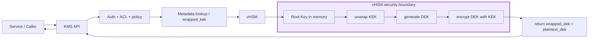
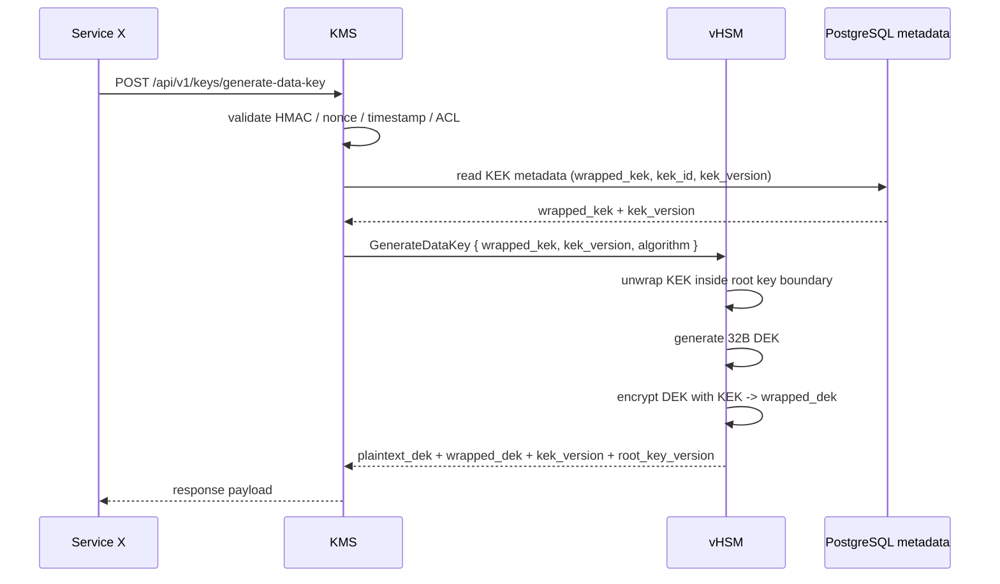

# Generate Data Key API

## 1. Cel endpointu

Endpoint `POST /api/v1/keys/generate-data-key` jest częścią modelu Envelope Encryption:

- KMS pełni rolę orchestratora i waliduje żądanie,
- vHSM odpowiada za trwałe przechowywanie klucza głównego (root key) oraz za całą kryptografię hierarchii kluczy,
- KEK jest odwijany wewnątrz vHSM,
- DEK jest generowany wewnątrz vHSM i zwracany tylko w formie wynikowej (`plaintext_dek` oraz `wrapped_dek`), bez wydostawania jawnego KEK poza granicę vHSM.

Dla tej operacji najważniejsze jest rozróżnienie pomiędzy:

- `wrapped_kek`: zaszyfrowany KEK, przechowywany w metadatach lub przekazywany do vHSM,
- `plaintext_dek`: klucz danych w postaci jawnej (w pamięci procesu / w odpowiedzi do klienta, zgodnie z polityką API),
- `wrapped_dek`: DEK zaszyfrowany kluczem KEK, przeznaczony do dalszego przechowywania.

> W praktyce KMS nie wykonuje żadnych operacji kryptograficznych na plaintext KEK/ROOT. Całość operacji `ROOT -> KEK -> DEK` przebiega wewnątrz vHSM.

---

## 2. Architektura bezpieczeństwa



Najważniejsze założenia bezpieczeństwa:

1. Root key i plaintext KEK nie opuszczają pamięci procesu vHSM.
2. KMS nie ma dostępu do plaintext ROOT/KEK.
3. KMS jest tylko orchestratorem: auth, ACL, metadata, audit, wywołanie HSM.
4. `wrapped_kek` jest jedyną formą, którą można przenieść poza vHSM i przechować w metadanych / repozytorium.
5. vHSM zwraca jedynie wynik operacji (np. `wrapped_dek`, `plaintext_dek` i wersje kluczy), a nie wskaźniki do surowej pamięci root key.

---

## 3. Protokołowy kontrakt HSM

Wewnętrzny kontrakt vHSM jest zdefiniowany przez typy `HsmRequest` i `HsmResponse`.

### 3.1 `HsmRequest::GenerateDataKey`

```rust
GenerateDataKey {
    wrapped_kek: Vec<u8>,
    kek_version: Option<u32>,
    algorithm: String,
}
```

### 3.2 `HsmResponse::DataKeyGenerated`

```rust
DataKeyGenerated {
    plaintext_dek: Vec<u8>,
    wrapped_dek: Vec<u8>,
    kek_version: u32,
    root_key_version: u32,
}
```

W praktyce vHSM wykonuje:

```text
ROOT
  └─ unwrap wrapped_kek
       └─ plaintext KEK
             ├─ generate 32B DEK
             └─ KEK encrypt(DEK) => wrapped_dek
```

Po operacji vHSM nie powinien pozostawiać jawnego KEK w pamięci. W kontekście białego opakowania bezpieczeństwa, składowe wymienione w `DataKeyGenerated` są jedynym rezultatem, którego można użyć dalej.

---

## 4. HTTP endpoint: `POST /api/v1/keys/generate-data-key`

### 4.1 Cel użycia

Endpoint służy do wygenerowania DEK na podstawie istniejącego KEK w ramach schematu Envelope Encryption.

Przykład użycia:

- usługa pobiera metadane KEK (`kek_id`, `wrapped_kek`, `kek_version`),
- KMS waliduje tożsamość korzystającego serwisu,
- KMS / vHSM wykonują operację `GenerateDataKey`,
- klient otrzymuje `plaintext_dek` i `wrapped_dek` zgodnie z polityką odpowiedzi.

### 4.2 Nagłówki żądania

Wszystkie chronione endpointy KMS wymagają podpisu HMAC i śledzenia limitów żądań.

#### Wymagane nagłówki uwierzytelniające

- `Content-Type: application/json`
- `X-Service-Name: <service-name>`
- `X-Timestamp: <RFC3339 timestamp>`
- `X-Nonce: <uuid>`
- `X-Body-SHA256: <hex>`
- `X-HMAC-Signature: <hex>`

#### Nagłówki limitowania / rate-limit

- `Retry-After` (jeżeli request zostanie odrzucony przez limiter)
- odpowiedź może zawierać również `X-RateLimit-Limit`, `X-RateLimit-Remaining` w zależności od konfiguracji middleware

> Jeżeli limit wyczerpie się, serwer może zwrócić `429 Too Many Requests` bez wykonywania operacji.

### 4.3 Request body

W ściśle publicznym API KMS w wersji orchestrationowej body jest zazwyczaj zminimalizowany:

```json
{
  "algorithm": "AES256GCM"
}
```

Jeżeli wywołanie jest wykonywane bezpośrednio przez warstwę KMS-vHSM lub w celu demonstracji kontraktu HSM, właściwe polecenie ma postać:

```json
{
  "wrapped_kek": "<base64-or-bytes>",
  "kek_version": 1,
  "algorithm": "AES256GCM"
}
```

### 4.4 Success response

#### Przykład odpowiedzi publicznej (KMS orchestration)

```json
{
  "algorithm": "AES256GCM",
  "key_version": 1,
  "wrapped_dek_b64": "8b2d7d0c6e4e5f...",
  "dek_b64": "1m7Xl9j8p7GqVh0N..."
}
```

#### Przykład odpowiedzi HSM / niskiego poziomu

```json
{
  "plaintext_dek": [1, 2, 3, 4, 5],
  "wrapped_dek": [9, 8, 7, 6, 5],
  "kek_version": 1,
  "root_key_version": 3
}
```

> W praktyce `plaintext_dek` to dane generowane i zwracane przez vHSM; `wrapped_dek` jest zaszyfrowanym materiałem klucza do dalszego użycia.

### 4.5 Błędy

#### 400 Bad Request

```json
{
  "code": "VALIDATION_ERROR",
  "message": "Invalid request"
}
```

Przykładowy powód:

- nieobsługiwany `algorithm`,
- uszkodzony JSON,
- brak wymaganych pól.

#### 403 Forbidden

```json
{
  "code": "UNAUTHORIZED",
  "message": "Authentication failed"
}
```

Przykładowy powód:

- brak praw ACL,
- nieautoryzowany serwis,
- naruszenie polityki dostępu do `GenerateDataKey`.

#### 409 Conflict

```json
{
  "code": "CONFLICT_ERROR",
  "message": "Requested KEK version 2 does not match active KEK version 1"
}
```

Przykładowy powód:

- żądany `kek_version` nie zgadza się z aktywnym stanem vHSM,
- konflikt wersji klucza.

#### 422 Unprocessable Entity

```json
{
  "code": "CRYPTO_FAILURE",
  "message": "Failed to unwrap KEK: decryption failed"
}
```

Przykładowy powód:

- niepoprawny `wrapped_kek`,
- uszkodzona jakość ciphertext,
- błąd dekrypcji KEK / DEK wewnątrz vHSM.

#### 500 Internal Server Error

```json
{
  "code": "INTERNAL_SERVER_ERROR",
  "message": "Internal server error"
}
```

Przykładowy powód:

- wewnętrzny błąd vHSM,
- błąd serializacji / wewnętrzny wyjątek,
- nieobsłużony błąd kryptograficzny.

---

## 5. Przykłady użycia

### 5.1 `curl` do publicznego endpointu KMS

```bash
curl -X POST http://127.0.0.1:7000/api/v1/keys/generate-data-key \
  -H "Content-Type: application/json" \
  -H "X-Service-Name: auth-service" \
  -H "X-Timestamp: 2026-08-25T12:00:00Z" \
  -H "X-Nonce: 1d0ec523-3c28-4cf0-b0ae-0c2d358a54af" \
  -H "X-Body-SHA256: <sha256_body>" \
  -H "X-HMAC-Signature: <hmac_hex>" \
  -d '{
    "algorithm": "AES256GCM"
  }'
```

### 5.2 `curl` do warstwy HSM (bezpośrednio / model niskiego poziomu)

```bash
curl -X POST http://127.0.0.1:7000/api/v1/keys/generate-data-key \
  -H "Content-Type: application/json" \
  -H "X-Service-Name: auth-service" \
  -H "X-Timestamp: 2026-08-25T12:00:00Z" \
  -H "X-Nonce: c7b66be6-68c3-49bf-bc27-7ce7a227d58a" \
  -H "X-Body-SHA256: <sha256_body>" \
  -H "X-HMAC-Signature: <hmac_hex>" \
  -d '{
    "wrapped_kek": "<base64_encoded_wrapped_kek>",
    "kek_version": 1,
    "algorithm": "AES256GCM"
  }'
```

### 5.3 Sekwencja wywołań: flow krok po kroku



Przykładowy flow:

1. Serwis `Service X` wywołuje `POST /api/v1/keys/generate-data-key`.
2. KMS waliduje podpis HMAC i reguły ACL.
3. KMS pobiera `wrapped_kek` oraz `kek_version` z magazynu metadanych.
4. KMS przekazuje do vHSM:

```json
{
  "wrapped_kek": "AQIDBA==",
  "kek_version": 1,
  "algorithm": "AES256GCM"
}
```

5. vHSM wewnątrz procesu:
   - rozpakowuje `wrapped_kek` przy użyciu klucza głównego,
   - generuje nowy 32B DEK,
   - szyfruje DEK za pomocą KEK,
   - zwraca wynik:

```json
{
  "plaintext_dek": "<raw_dek_bytes>",
  "wrapped_dek": "<base64_or_binary>",
  "kek_version": 1,
  "root_key_version": 3
}
```

6. KMS zwraca odpowiedź klientowi w formacie zgodnym z polityką API, np.:

```json
{
  "algorithm": "AES256GCM",
  "key_version": 1,
  "wrapped_dek_b64": "...",
  "dek_b64": "..."
}
```

---

## 6. Dobre praktyki i ograniczenia

- Nie przekazuj `plaintext_kek` do KMS ani do klienta.
- Nie zapisuj `plaintext_kek` ani `plaintext_dek` w PostgreSQL / Redis / logach.
- `wrapped_kek` i `wrapped_dek` należy przechowywać jako dane binarne lub zakodowane w Base64, ale nigdy jako jawny klucz.
- Każda zmiana wersji KEK (`kek_version`) powinna być sprawdzana względem aktywnego stanu vHSM.
- Wszelkie błędy `409`, `422` i `500` powinny być audytowane i rejestrowane, ale bez wycieku materiału klucza.

---

## 7. Podsumowanie

Endpoint `POST /api/v1/keys/generate-data-key` ma za zadanie zapewnić bezpieczne wygenerowanie DEK na podstawie istniejącego KEK zgodnie z pojęciem Envelope Encryption.

W modelu bezpiecznym:

- KMS waliduje i orkiestruje,
- vHSM wykonuje root/KEK/DEK workflow,
- KEK pozostaje w hermetycznej warstwie vHSM,
- klient otrzymuje tylko rezultat operacji zgodny z polityką API, bez naruszenia granicy bezpieczeństwa.
